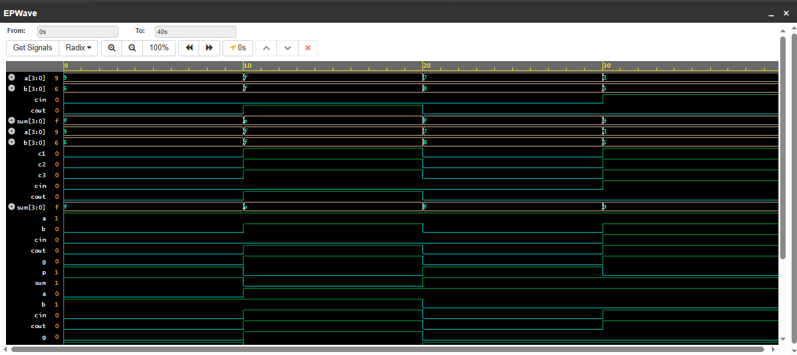
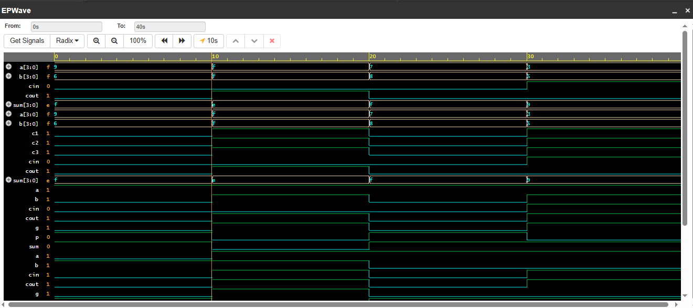

## 4-bit Ripple Carry Adder

Adds two 4-bit numbers using 4 Full Adder modules chained together.

**Inputs:** a[3:0], b[3:0], cin  
**Outputs:** sum[3:0], cout  
**Max result:** 15+15=30 (5-bit output)

### Waveform

