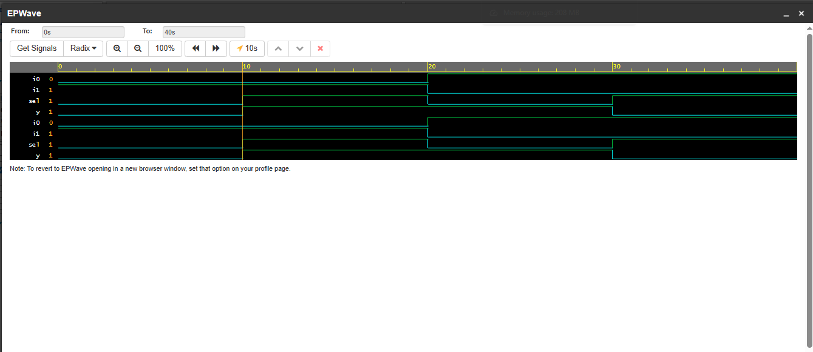

## 2:1 MUX (Multiplexer)

Selects one of two inputs based on select line.

**Inputs:** i0, i1, sel  
**Outputs:** y  
**Concept:** Ternary operator, data routing

### Truth Table

| sel | y |
|-----|---|
| 0   | i0 |
| 1   | i1 |

### RUN 
[Click here to simulate On EDA Player](https://www.edaplayground.com/x/ePUv)

### Logic
if sel=0 → y = i0  
if sel=1 → y = i1

### Waveform

