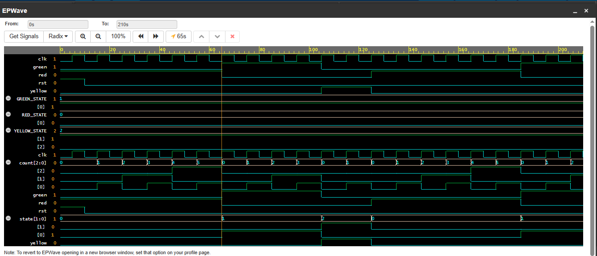

## Traffic Light Controller — FSM

Controls traffic light sequence using Moore FSM architecture.

**Inputs:** clk, rst  
**Outputs:** red, yellow, green  
**Concept:** Moore FSM, state encoding, timer counter, output logic

### FSM States

| State | Red | Yellow | Green | Duration |
|-------|-----|--------|-------|----------|
| RED | ON | OFF | OFF | 6 cycles |
| GREEN | OFF | OFF | ON | 4 cycles |
| YELLOW | OFF | ON | OFF | 2 cycles |

### State Transition
RED → GREEN → YELLOW → RED (repeats forever)

### Key Concepts
- Moore FSM — outputs depend only on current state
- Two always blocks — state logic + output logic separated
- `count` register — internal timer for state duration
- Safe reset state — always resets to RED on power up

### Run Online
[Click here to simulate on EDA Playground](https://www.edaplayground.com/x/emzY)

### Waveform

