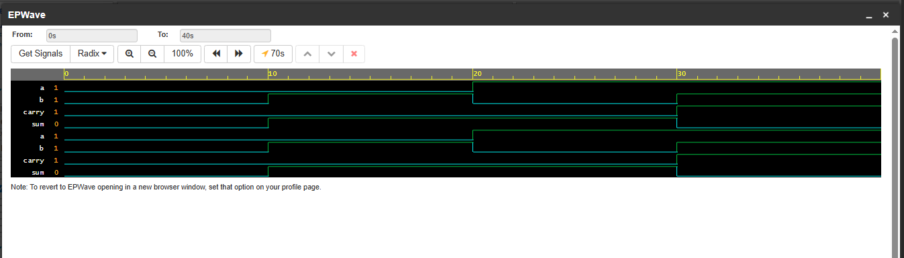

## Half Adder

Adds two 1-bit numbers without carry input.

**Inputs:** a, b  
**Outputs:** sum, carry  
**Gates used:** 1 XOR, 1 AND (2 gates total)  
**Concept:** Basic combinational logic, assign statement

### Truth Table

| a | b | sum | carry |
|---|---|-----|-------|
| 0 | 0 | 0   | 0     |
| 0 | 1 | 1   | 0     |
| 1 | 0 | 1   | 0     |
| 1 | 1 | 0   | 1     |

### Run Online
[Click here to simulate on EDA Playground](https://www.edaplayground.com/x/eMLH)

### Waveform

